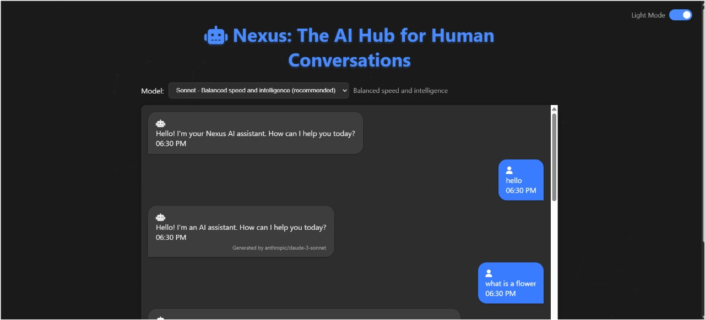
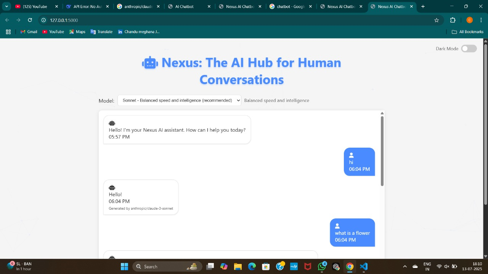

<h1>Nexus AI Chatbot 🤖💬</h1>

✨ Features
Multi-Model AI - Switch between Claude Haiku/Sonnet/Opus

Smart UI - Dark/light mode with localStorage persistence

Rich Messaging - Markdown support (bold, code blocks, italics)

Animated Interface - Particle.js background, message animations

Production-Ready - Error handling & rate limiting

🛠 Tech Stack
Component	Technology
Frontend	Vanilla JS, CSS3, Particles.js
Backend	Python/Flask
API Gateway	OpenRouter API
Styling	CSS Variables + Flexbox
Animations	CSS Keyframes + JS IntersectionObserver
🚀 Installation
Prerequisites
Python 3.8+

OpenRouter API key (get one here)

Setup
bash
# Clone repo
git clone https://github.com/shannugarlapati/nexus-chatbot.git

cd nexus-chatbot

# Create virtual environment
python -m venv venv
source venv/bin/activate  # Linux/Mac
venv\Scripts\activate     # Windows

# Install dependencies
pip install -r requirements.txt

# Configure environment
echo "OPENROUTER_API_KEY=your_key_here" > .env
⚙ Configuration
Edit config.json for:

json
{
  "default_model": "anthropic/claude-3-haiku",
  "rate_limit": "10 requests/minute",
  "theme": "system" // or "light"/"dark"
}
🌐 API Reference
Endpoints
Endpoint	Method	Description
/	GET	Chat UI
/chat	POST	Process messages ({message: string, model: string})

